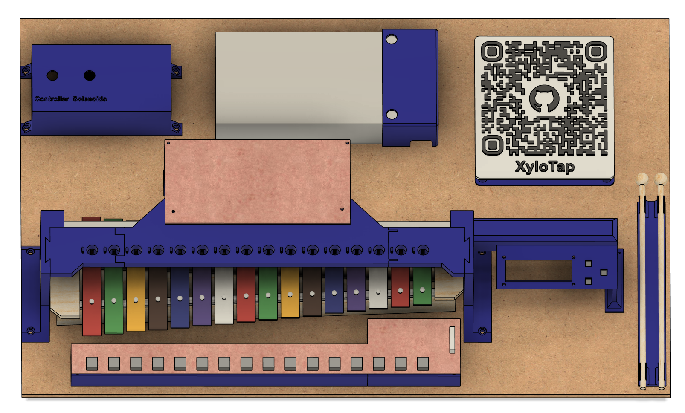
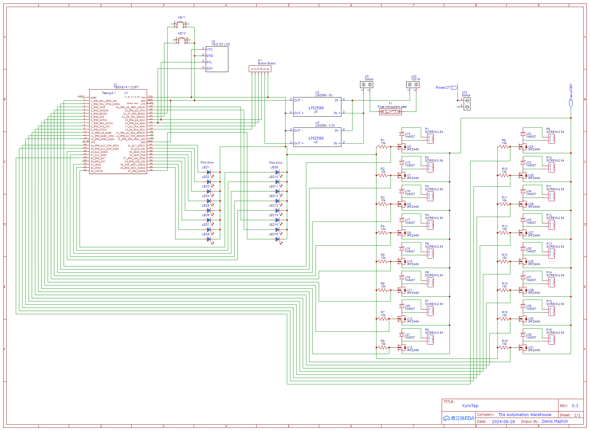
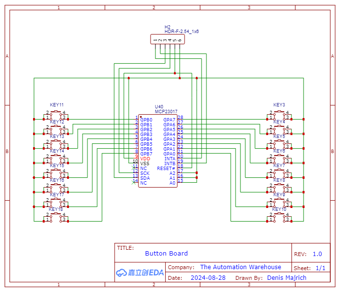

# XyloTap

WORK IN PROGRESS

Made as part of Arcade Hack Club

Used github copilot when writing code and readme

## Introduction

This project is and attempt to create a xylaphone that can play itself.
In the end the user simply uploads a midi file to an SD card and the xylaphone will play the song.
The ultimate goal is to play RUSH E by Street Music Boss.
I also want to have a dedicated button for each note so that the user can play the xylaphone manually like a piano.

## Hardware

CAD - Work in progress

I started with the biggest xylaphone (16 keys) I could find cheaply online and then designed the rest of the hardware around it.
A 3D printed structure holds the soleinoids in place and allows adjustment to make them hit the keys correctly.
I used an 8mm thick MDf board as the base.

## Electronics

Controller Schematic - Work in progress

The brains of the operation is a Teensy 4.1 microcontroller.
Each solenoid is controlled by an IRFZ44N MOSFET and has an LED to indicate when it is active.

The user interface consists of a 16x2 I2C LCD screen, and 3 buttons.

The individual key buttons are mounted on a separate board through the MCP23017 I2C GPIO expander due to the limited number of pins on the Teensy.

Everything is powered by a 12V 25A power supply with two buck converters for the 5V and 3.3V rails to power the control electronics.

## Software

Have not started on the software yet.

## Current Status

I have the electronics and mechanical build mostly planned out.
I have machined and soldered the first part of the button board.
I am working on the rest of the button board and finishing the CAD.
I am waiting for the control electronics to arrive.